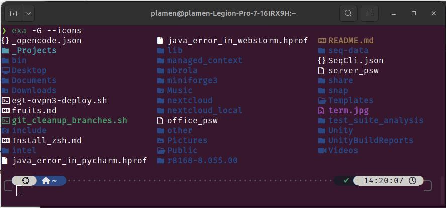

## Pimp Your Terminal
show note from youtube video ->



### ZSH installation and basic configurations

#### Install ZSH
```bash
sudo apt install zsh
```

#### Set zsh as default
```bash
chsh -s $(which zsh)
```

#### Show current shell
```bash
echo $SHELL
```

#### Install ohmyzsh
```
sh -c "$(curl -fsSL https://raw.githubusercontent.com/ohmyzsh/ohmyzsh/master/tools/install.sh)"
```

### ZSH themes 

#### zsh default themes
https://github.com/ohmyzsh/ohmyzsh/wiki/Themes

Edit `.zshrc`

ZSH_THEME="jonathan"

### Install required fonts

##### Nerd Font
https://www.nerdfonts.com/

https://github.com/ryanoasis/nerd-fonts/tree/master/patched-fonts/FiraMono

download and install FiraMono for linux

##### Verify font
```bash
fc-match -f "%{family}\n" | head -n 1
```


### ZSH plugins

##### plugins include with ohmyzsh
https://github.com/ohmyzsh/ohmyzsh/wiki/Plugins

Edit `.zshrc` to include plugins
plugins=(git zsh-autosuggestions zsh-syntax-highlighting)

#### Must-Have plugins
```bash
git clone https://github.com/zsh-users/zsh-autosuggestions.git $ZSH_CUSTOM/plugins/zsh-autosuggestions
```

```bash
git clone https://github.com/zsh-users/zsh-syntax-highlighting.git $ZSH_CUSTOM/plugins/zsh-syntax-highlighting
```

##### Install Powerlevel 10k
```bash
git clone https://github.com/romkatv/powerlevel10k.git $ZSH_CUSTOM/themes/powerlevel10k
```

Edit `.zshrc`

ZSH_THEME="powerlevel10k/powerlevel10k"

POWERLEVEL9K_MODE="nerdfont-complete"

### ZSH additional tweaks

#### Fix command-not-found missing in `zsh`
Ubuntu’s bash uses command-not-found, and zsh can use it too — it’s just not enabled by default.

add this to `.zshrc`
```bash
source /etc/zsh_command_not_found
```
**optional:** Use oh‑my‑zsh plugin instead

edit `.zshrc`
```
plugins=(git command-not-found)
```

#### Use `eza` instead of `ls`

eza is a fast, colorful, Git‑aware, feature‑rich file‑listing tool that improves on ls with better defaults and modern terminal UX. 

⭐ Key features that make eza better than ls
Colorized output for file types, metadata, permissions

- Git integration (shows repo status inline) 
- Icons support (when using a Nerd Font) 
- Group directories first for cleaner listings 
- Hyperlink support (open files directly from terminal) 
- SELinux context output for security‑focused systems 
- Human‑readable relative dates (e.g., “3 hours ago”) 
- Mount point details and extended attributes awareness 
- Fixes bugs from exa, including the “grid bug” 

```bash
alias l='eza --icons --group-directories-first'
alias ll='eza -l --git --icons --group-directories-first'
alias la='eza -a --icons --group-directories-first'
alias lla='eza -al --git --icons --group-directories-first'
```
